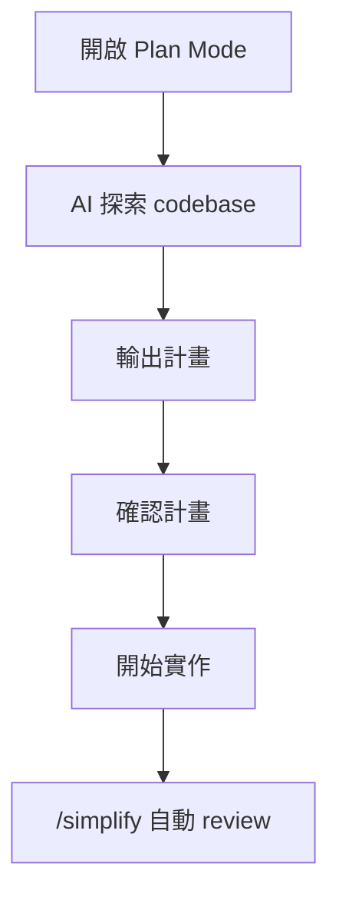
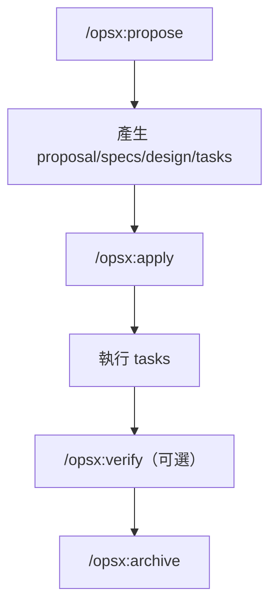
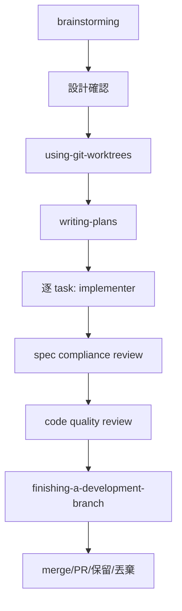
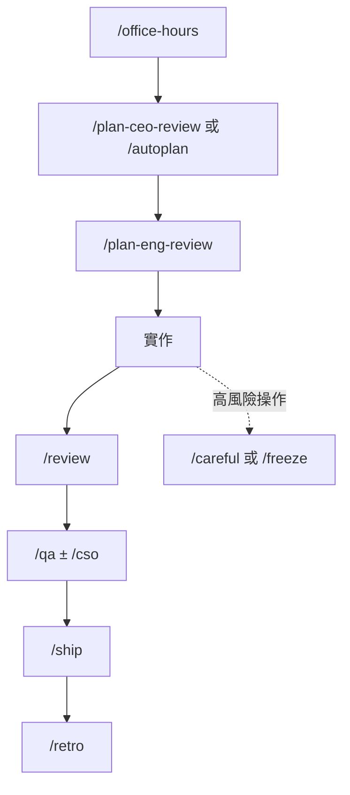
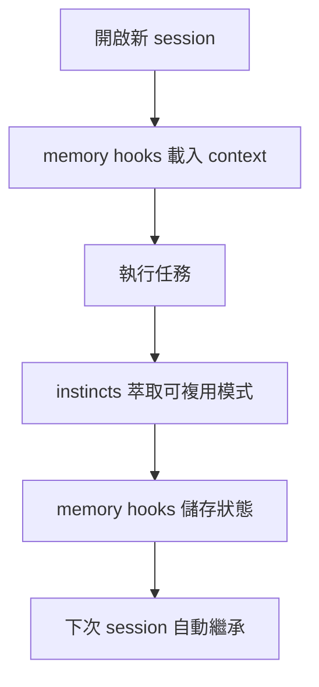

> 📅 **研究時間：2026 年 3 月**
> AI 工具迭代極快，文章中提到的功能、指令或框架設計，三個月後可能就有重大變化。本文記錄的是當下的觀察與比較，讀者使用前建議確認最新官方文件。

AI 寫 code 的品質瓶頸，不只是 prompt 好不好，還有流程。三個月後回來看 code，context 丟了，只剩 code，設計決策就消失了。社群裡最近出現一批工具，切入點不同——規格、流程、review、底層優化——但都在解決同一件事：讓 AI 產出的東西有持久價值。以下是這五個工具的完整比較。

## 五個工具概覽

| 工具 | 定位 | 核心解決問題 | 上手難度 |
|------|------|------------|--------|
| Claude Code 原生 | 內建功能，無需安裝 | 並行執行、探索前置 | ⭐ |
| OpenSpec | 規格管理框架 | 設計決策持久化、可追溯 | ⭐⭐ |
| Superpowers | 完整開發生命週期 | 全流程自動化 + TDD 強制 | ⭐⭐⭐ |
| gstack | 多角色 review 框架 | 多視角品質把關（20 個角色） | ⭐⭐ |
| everything-claude-code | 底層效能優化層 | context 持久化 + agent 體質 | ⭐⭐⭐⭐ |

---

## Claude Code 原生

**Plan Mode + Bundled Skills，不需要安裝任何東西。**

### 核心功能

- **Plan Mode**：輸入 `/plan [任務描述]` 進入；AI 探索 codebase、問問題，不修改 source code，輸出計畫讓你確認後再實作
- **`/simplify`**：自動派三個平行 review agents 找品質問題並修正
- **`/batch <instruction>`**：大規模並行改動（需在 git repository 內），自動拆成 5-30 個 task，每個在獨立 git worktree 執行並可開 PR
- **`/loop [interval] <prompt>`**：定時循環執行，用來 polling deploy 狀態（僅當前 session 有效，關掉即失效）
- **`/debug`**：mid-session 啟用 debug logging，分析日誌找問題根因
- **`/claude-api`**：自動載入當前語言的 Claude API 文件；偵測到 `anthropic`、`@anthropic-ai/sdk`、`claude_agent_sdk` 匯入時也可自動觸發
- **CLAUDE.md**：放專案根目錄，每次 session 自動讀取，存架構決策、開發規範、review checklist

### 工作流程

### 適合情境

還沒有明確瓶頸、不想先學一套框架。先把原生的用熟，再決定要補什麼。大部分人低估了 `/batch` 和 Plan Mode 的威力——這兩個加在一起已經涵蓋了不少第三方框架的核心功能。

---

## OpenSpec

**在 AI 動 code 之前先對齊規格，留下可追溯的設計決策。**

### 核心功能

- **change 資料夾**：每個功能變更建立一個，包含四份 artifacts：`proposal.md`（為什麼做）、`specs/`（規格增刪改）、`design.md`（怎麼做）、`tasks.md`（實作清單）
- **spec delta**：只記錄規格的增刪改，不覆蓋整份文件，reviewer 不用翻 code
- **archive 指令**：做完後歸檔到 `openspec/changes/archive/YYYY-MM-DD-.../`，保留完整歷史紀錄
- **工具無關**：不需要 API key 或 MCP，Claude Code、Cursor、GitHub Copilot 都能搭配

### 工作流程

### 適合情境

在意可追溯性、設計決策一直消失的情境——不管是 side project 還是多人協作。archive 的價值在時間軸上才顯現：三個月後打開 change folder，「當初為什麼選這個架構」的答案在那裡。

---

## Superpowers

**接管整個開發生命週期：從 brainstorming 到 merge，包含強制 TDD。**

### 核心功能

- **Brainstorming skill**：問清楚需求，分段讓你 approve 才繼續
- **git worktree 隔離**：先建立 feature 級隔離工作空間，再在其中執行 tasks
- **subagent 逐 task 執行**：每個 task 2-5 分鐘，獨立 subagent 逐項完成
- **強制 TDD**：先寫 failing test，再寫 code，不可跳過
- **雙層自動 review**：先查 spec compliance（有沒有多做/少做），再查程式品質
- **Skills 自動觸發**：agent 自動判斷並強制執行，也可透過對話直接介入調整流程

### 工作流程

### 適合情境

需要 TDD 保障、可以讓 AI 長時間自主執行的中大型任務。即使小任務也必須走完整流程（設計文件可以很短）。真正**不適合**的是無法等待規劃的緊急 hotfix——Superpowers 明確說「every project goes through this process. A todo list, a single-function utility, a config change — all of them.」

---

## gstack

**28 個 slash commands，其中 20 個是不同角色，補足 solo 開發缺少多視角 review 的問題。**

官方自述：Garry Tan（Y Combinator CEO）用這套工具，60 天產出 60 萬行 production code（含 35% 測試）。使用前提是需有 Claude Code 環境，並安裝 Git、Bun（Windows 另需 Node.js）。

### 核心功能

**20 個角色指令（部分）：**

| 指令 | 角色 | 用途 |
|------|------|------|
| `/plan-ceo-review` | CEO | 產品需求視角 |
| `/plan-eng-review` | Engineering Manager | 架構與技術決策 |
| `/review` | Staff Engineer | 程式碼 review |
| `/qa` | QA Lead | 測試品質把關 |
| `/cso` | Security Officer | OWASP 安全審查 |

**8 個工具與安全護欄：**

- `/ship`：準備部署流程
- `/browse`：啟動真實瀏覽器測試
- `/careful`：`rm -rf`、`DROP TABLE`、force-push 等危險操作前強制確認
- `/freeze`：Edit Lock，限制 Claude 只能修改特定目錄，避免除錯時誤改範圍外的程式碼
- `/guard`：`/careful` + `/freeze` 合一的護欄

### 工作流程

### 適合情境

Solo 開發想要多視角把關品質。特別是 `/cso` Security Officer——這個視角平常不太會主動切換，但它涵蓋的問題（OWASP、依賴漏洞）很容易被忽略。

---

## everything-claude-code

**不是工作流框架，是疊在主流 AI coding agent（Claude Code、Cursor、Codex、OpenCode）之上的效能優化層。**

Anthropic × Cerebral Valley 舉辦的 Claude Code Hackathon 得獎作品，GitHub 50K+ stars，10+ 個月每日實戰演化出來。28 agents、125 skills、60 commands。

### 核心功能

- **Memory hooks**：自動跨 session 儲存、載入 context，agent 不用每次從零開始
- **Instincts 系統**：從每次 session 自動萃取可複用模式，越用越聰明
- **Token 管理**：提供 token 優化策略（model routing、context slimming、compact/eval 流程）
- **安全掃描**：提供可啟用的安全審查能力（如 AgentShield/掃描流程）
- **可疊加**：OpenSpec 記規格、everything-cc 記 session context，兩個方向不衝突

### 工作流程

### 適合情境

Claude Code session 一開新對話就失憶、token 燒得比預期快、同樣的問題一直要反覆解釋。注意：上手門檻最高，光看到「28 agents、125 skills、60 commands」不知道從哪裡開始是正常的；短任務或一次性小改動通常不划算，更適合長週期、多 session 的工作流。裝上去也不代表流程自動變好，還是需要有個主方法論在上面跑。

---

## 完整比較

| 維度 | Claude Code 原生 | OpenSpec | Superpowers | gstack | everything-cc |
|------|:---:|:---:|:---:|:---:|:---:|
| **主要解決** | 並行執行 + 探索前置 | 規格追溯 | 全流程自動化 | 多角色 review | context 持久化 |
| **工作流強制度** | 低 | 中 | 高 | 中 | 低 |
| **適合任務大小** | 任何 | 任何 | 中～大型 | 任何 | 任何 |
| **TDD 支援** | 無 | 無 | 強制 | 有（`/qa`） | 無 |
| **跨 session 記憶** | CLAUDE.md | spec archive | 無 | 無 | memory hooks |
| **安裝需求** | 無 | 安裝 CLI | 安裝 skill pack | 安裝 skill pack | 安裝框架 |
| **上手時間** | 即刻 | 約 1 小時 | 約半天 | 約 2 小時 | 數天 |
| **可與其他工具疊加** | ✅ | ✅ | ⚠️ 部分重疊 | ✅ | ✅ |

---

## 如何選擇

根據你現在最卡的瓶頸選，不是根據功能多寡：

| 你的主要瓶頸 | 建議工具 | 原因 |
|------------|--------|------|
| 還沒有明確瓶頸 | Claude Code 原生 | Plan Mode + `/batch` 已解決大部分問題，零額外成本 |
| 設計決策一直消失，review 越來越難 | OpenSpec | spec delta + archive 讓三個月後還看得懂 |
| 想要全流程 TDD 保障 | Superpowers | 唯一強制 TDD 的框架，不可跳過 |
| Solo 開發沒人 review | gstack | 20 個角色視角補足盲點，Security 特別有用 |
| Context 一直丟失、token 燒太快 | everything-cc | memory hooks 解決跨 session 失憶 |
| 規格 + context 都要 | OpenSpec + everything-cc | 兩個方向不重疊，可以疊加 |

> ⚠️ **避免組合**：OpenSpec + Superpowers 同時用——兩者的 brainstorming + planning 高度重疊，流程反而更重。選一個主框架，另一個補足它不擅長的地方。

---

## 我的選擇

目前用 **OpenSpec + Claude Code 原生**，加上 Plan Mode。

選 OpenSpec 的原因很實際：最大的痛點是設計決策會消失，OpenSpec 讓每個 change 都留下 proposal 和 design，這個問題基本上消失了。Plan Mode 是零成本的安全帶，任何任務都先開；大規模改動用 `/batch`。

Superpowers 的流程太重，大部分任務不值得；gstack 的多角色 review 吸引人，但 28 個 commands 需要時間建立習慣；everything-cc 等哪天 agent 效能真正成為瓶頸再說。問題不是「哪個工具最強」，而是「你現在最卡在哪裡」。
