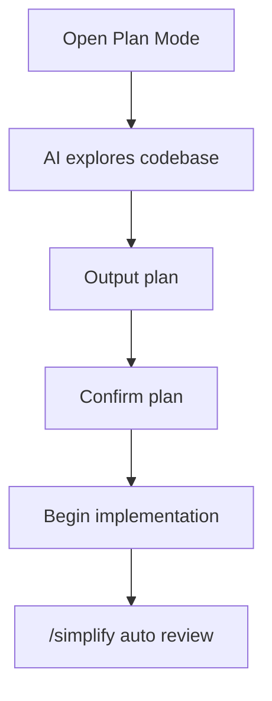
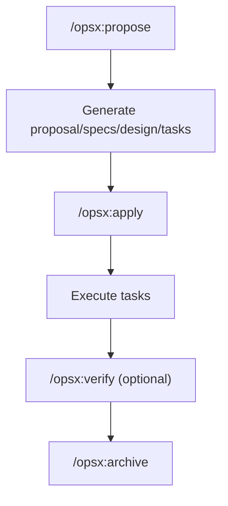
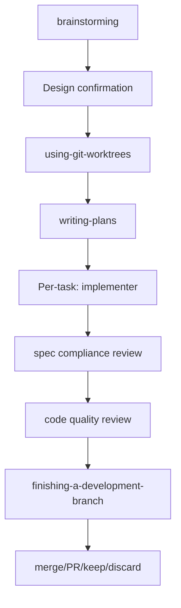
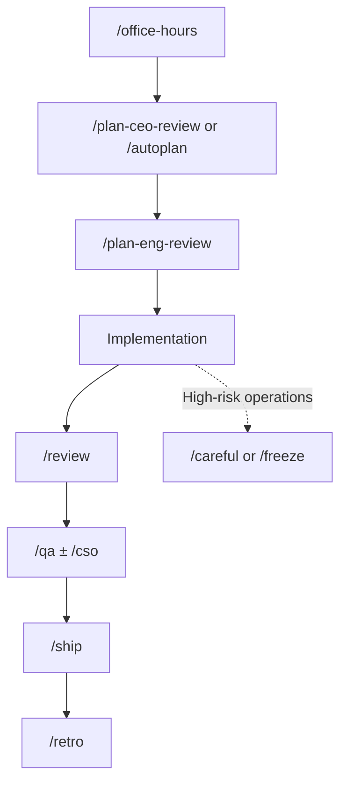
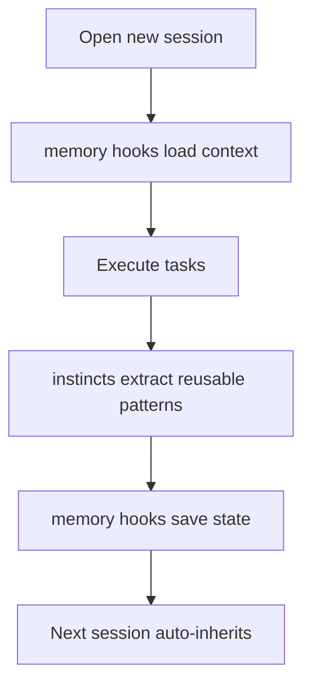

> 📅 **Research date: March 2026.** AI tools iterate extremely fast — the features, commands, or framework designs mentioned in this article may undergo major changes within three months. This article captures observations and comparisons as of the time of writing. Readers are advised to check the latest official documentation before use.

The quality bottleneck of AI-generated code isn't just about how good the prompt is — it's about the process. Come back to the code three months later and the context is gone, only the code remains, and the design decisions have vanished. A wave of tools has recently emerged in the community, each with a different angle — specs, workflows, review, low-level optimization — but they're all solving the same problem: making AI output have lasting value. Here's a comprehensive comparison of these five tools.

## Overview of the Five Tools

| Tool                   | Positioning                          | Core Problem Solved                        | Learning Curve |
| ---------------------- | ------------------------------------ | ------------------------------------------ | -------------- |
| Claude Code Native     | Built-in features, no install needed | Parallel execution, exploration-first      | ⭐             |
| OpenSpec               | Spec management framework            | Persistent, traceable design decisions     | ⭐⭐           |
| Superpowers            | Full development lifecycle           | End-to-end automation + enforced TDD       | ⭐⭐⭐         |
| gstack                 | Multi-role review framework          | Multi-perspective quality gates (20 roles) | ⭐⭐           |
| everything-claude-code | Low-level performance optimization   | Context persistence + agent fundamentals   | ⭐⭐⭐⭐       |

---

## Claude Code Native

**Plan Mode + Bundled Skills — no installation required.**

### Core Features

- **Plan Mode**: Enter with `/plan [task description]`; AI explores the codebase, asks questions, and doesn't modify source code — it outputs a plan for you to confirm before implementation
- **`/simplify`**: Automatically dispatches three parallel review agents to find quality issues and fix them
- **`/batch <instruction>`**: Large-scale parallel changes (requires a git repository), automatically splits into 5–30 tasks, each executed in an independent git worktree with the option to open PRs
- **`/loop [interval] <prompt>`**: Runs on a timed loop, useful for polling deploy status (only active for the current session — closes when the session ends)
- **`/debug`**: Enables debug logging mid-session, analyzes logs to find root causes
- **`/claude-api`**: Automatically loads Claude API docs for the current language; can also auto-trigger when imports of `anthropic`, `@anthropic-ai/sdk`, or `claude_agent_sdk` are detected
- **CLAUDE.md**: Place in the project root — automatically read at the start of every session, storing architectural decisions, development conventions, and review checklists

### Workflow

### When to Use

When you don't have a clear bottleneck yet and don't want to learn a framework first. Get comfortable with the native tools, then decide what to supplement. What most people underestimate is **Plan Mode** — it doesn't change how fast you work, it changes the rhythm of collaborating with AI: having the AI propose a plan first and executing only after you confirm dramatically reduces going off-track. `/batch` is an advanced tool to learn when you have a concrete need — no rush.

---

## OpenSpec

**Align on specs before AI touches the code, leaving traceable design decisions behind.**

### Core Features

- **change folder**: Created for each feature change, containing four artifacts: `proposal.md` (why we're doing it), `specs/` (spec additions/modifications/deletions), `design.md` (how we're doing it), `tasks.md` (implementation checklist)
- **spec delta**: Records only the additions, modifications, and deletions to specs — doesn't overwrite the entire document, so reviewers don't have to dig through code
- **archive command**: After completion, archives to `openspec/changes/archive/YYYY-MM-DD-.../`, preserving the complete history
- **Tool-agnostic**: No API key or MCP required — works with Claude Code, Cursor, GitHub Copilot, and more

### Workflow

### When to Use

When traceability matters and design decisions keep disappearing — whether it's a side project or a team collaboration. The value of archiving reveals itself over time: three months later, open the change folder, and the answer to "why did we choose this architecture?" is right there.

---

## Superpowers

**Takes over the entire development lifecycle: from brainstorming to merge, with enforced TDD.**

### Core Features

- **Brainstorming skill**: Clarifies requirements, requiring your approval at each stage before proceeding
- **git worktree isolation**: Creates a feature-level isolated workspace first, then executes tasks within it
- **Subagent per-task execution**: Each task takes 2–5 minutes, completed by an independent subagent one at a time
- **Enforced TDD**: Write a failing test first, then write code — no skipping allowed
- **Dual-layer auto review**: First checks spec compliance (anything added or missed?), then checks code quality
- **Auto-triggered Skills**: The agent automatically determines and enforces execution, and you can also intervene via conversation to adjust the workflow

### Workflow

### When to Use

For medium-to-large tasks that need TDD guarantees and where you can let the AI run autonomously for extended periods. Even small tasks must go through the full process (though the design doc can be brief) — "every project goes through this process. A todo list, a single-function utility, a config change — all of them."

What's truly **not suitable** is urgent hotfixes where you need to push immediately — the problem isn't TDD, it's that the upfront planning steps can't be rushed through in time.

---

## gstack

**28 slash commands, 20 of which are different roles, filling the multi-perspective review gap for solo developers.**

Per the official description: Garry Tan (Y Combinator CEO) used this toolset to produce 600K lines of production code (including 35% tests) in 60 days. Prerequisites: a Claude Code environment with Git and Bun installed (Windows also requires Node.js).

### Core Features

**20 Role Commands (partial list):**

| Command            | Role                | Purpose                            |
| ------------------ | ------------------- | ---------------------------------- |
| `/plan-ceo-review` | CEO                 | Product requirements perspective   |
| `/plan-eng-review` | Engineering Manager | Architecture & technical decisions |
| `/review`          | Staff Engineer      | Code review                        |
| `/qa`              | QA Lead             | Test quality gates                 |
| `/cso`             | Security Officer    | OWASP security audit               |

**8 Tools & Safety Guardrails:**

- `/ship`: Prepares the deployment process
- `/browse`: Launches real browser testing
- `/careful`: Forces confirmation before dangerous operations like `rm -rf`, `DROP TABLE`, force-push, etc.
- `/freeze`: Edit Lock — restricts Claude to only modify specific directories, preventing accidental changes outside the scope during debugging
- `/guard`: Combines `/careful` + `/freeze` into a single guardrail

### Workflow

### When to Use

For solo developers who want multi-perspective quality checks. `/cso` Security Officer is particularly noteworthy — it runs OWASP Top 10 + STRIDE threat modeling, the kind of audit most people wouldn't do manually before every PR. Handing it off to an agent is far more practical.

Note: `/guard` manages **AI behavioral safety** (preventing accidental file deletion, writing to wrong directories), while `/cso` manages **security vulnerabilities in the code itself** — two different dimensions that can't substitute for each other.

---

## everything-claude-code

**Not a workflow framework — it's a performance optimization layer that sits on top of mainstream AI coding agents (Claude Code, Cursor, Codex, OpenCode).**

Winner of the Claude Code Hackathon hosted by Anthropic x Cerebral Valley, 50K+ GitHub stars, evolved through 10+ months of daily real-world use. 28 agents, 125 skills, 60 commands.

### Core Features

- **Memory hooks**: Automatically saves and loads context across sessions — the agent doesn't have to start from zero every time
- **Instincts system**: Automatically extracts reusable patterns from each session, getting smarter with use
- **Token management**: Provides token optimization strategies (model routing, context slimming, compact/eval workflows)
- **Security scanning**: Offers activatable security audit capabilities (e.g., AgentShield/scanning workflows)
- **Stackable**: OpenSpec handles specs, everything-cc handles session context — the two directions don't conflict

### Workflow

### When to Use

When Claude Code forgets everything upon opening a new session, tokens burn faster than expected, and you keep having to re-explain the same things. Note: this has the highest learning curve — seeing "28 agents, 125 skills, 60 commands" and not knowing where to start is completely normal. Short tasks or one-off small changes usually don't justify the overhead. It's better suited for long-cycle, multi-session workflows. Installing it doesn't automatically improve your process either — you still need a primary methodology running on top.

---

## Full Comparison

| Dimension                  |      Claude Code Native       |     OpenSpec      |      Superpowers      |       gstack       |    everything-cc    |
| -------------------------- | :---------------------------: | :---------------: | :-------------------: | :----------------: | :-----------------: |
| **Primary Problem Solved** | Parallel exec + explore-first | Spec traceability | End-to-end automation | Multi-role review  | Context persistence |
| **Workflow Enforcement**   |              Low              |      Medium       |         High          |       Medium       |         Low         |
| **Suitable Task Size**     |              Any              |        Any        |     Medium–Large      |        Any         |         Any         |
| **TDD Support**            |             None              |       None        |       Enforced        |    Yes (`/qa`)     |        None         |
| **Cross-session Memory**   |           CLAUDE.md           |   spec archive    |         None          |        None        |    memory hooks     |
| **Installation Required**  |             None              |    Install CLI    |  Install skill pack   | Install skill pack |  Install framework  |
| **Time to Get Started**    |           Immediate           |      ~1 hour      |      ~half a day      |      ~2 hours      |    Several days     |
| **Stackable with Others**  |              ✅               |        ✅         |  ⚠️ Partial overlap   |         ✅         |         ✅          |

---

## How to Choose

Choose based on your current biggest bottleneck, not feature count:

| Your Main Bottleneck                                   | Recommended Tool         | Reason                                                               |
| ------------------------------------------------------ | ------------------------ | -------------------------------------------------------------------- |
| No clear bottleneck yet                                | Claude Code Native       | Plan Mode + `/batch` already solves most problems, zero extra cost   |
| Design decisions keep disappearing, reviews get harder | OpenSpec                 | spec delta + archive keeps things understandable three months later  |
| Want end-to-end TDD guarantees                         | Superpowers              | The only framework that enforces TDD — no skipping                   |
| Solo dev with no one to review                         | gstack                   | 20 role perspectives fill blind spots; Security is especially useful |
| Context keeps getting lost, tokens burn too fast       | everything-cc            | memory hooks solve cross-session amnesia                             |
| Need both specs + context                              | OpenSpec + everything-cc | Two non-overlapping directions, stackable                            |

> ⚠️ **Combination to avoid**: Using OpenSpec + Superpowers together — their brainstorming + planning phases overlap heavily, making the process heavier rather than lighter. Pick one as your primary framework and use the other to supplement what it lacks.

---

## My Choice

Currently using **OpenSpec + Claude Code Native**, along with Plan Mode.

The reason for choosing OpenSpec is practical: my biggest pain point was design decisions disappearing. OpenSpec ensures every change leaves behind a proposal and design doc — that problem is essentially gone. Plan Mode is a zero-cost safety net; I start it for every task. For large-scale changes, I use `/batch`.

Superpowers' process is too heavy — most tasks don't justify going through the full workflow. gstack's multi-role review is appealing, but 28 commands take time to build into habits. everything-cc can wait until agent performance truly becomes a bottleneck. The question isn't "which tool is the most powerful" — it's "where are you stuck right now."

---

## References

- **Claude Code Bundled Skills**: [code.claude.com/docs/en/skills](https://code.claude.com/docs/en/skills)
- **OpenSpec**: [github.com/Fission-AI/OpenSpec](https://github.com/Fission-AI/OpenSpec)
- **Superpowers**: [github.com/obra/superpowers](https://github.com/obra/superpowers)
- **gstack**: [github.com/garrytan/gstack](https://github.com/garrytan/gstack)
- **everything-claude-code**: [github.com/affaan-m/everything-claude-code](https://github.com/affaan-m/everything-claude-code)
